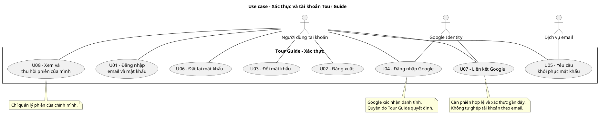
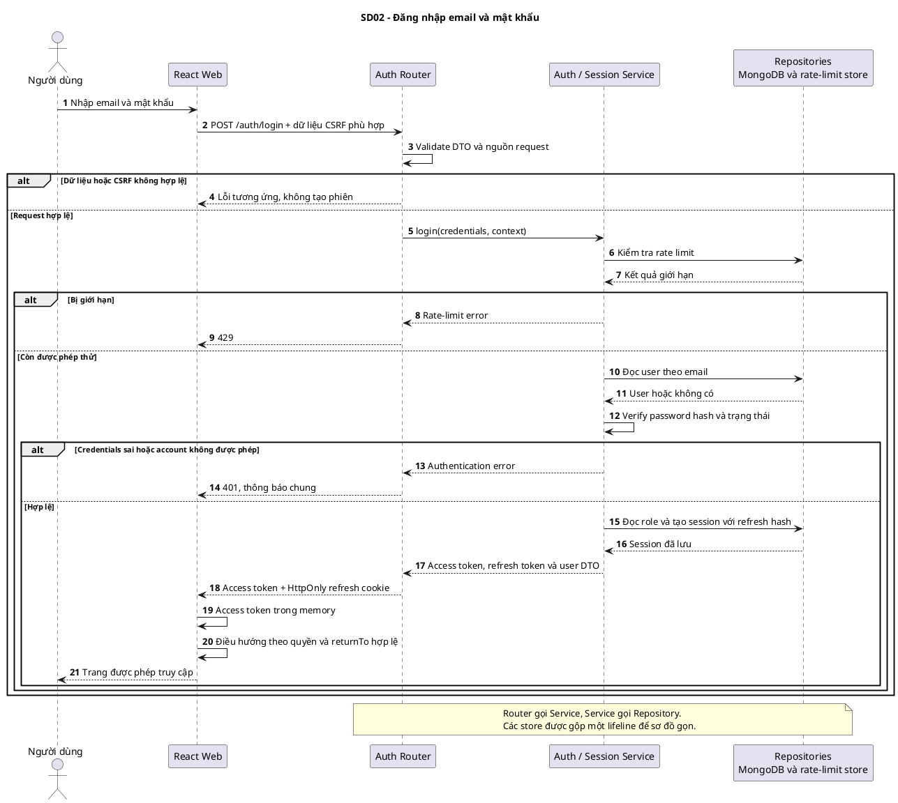
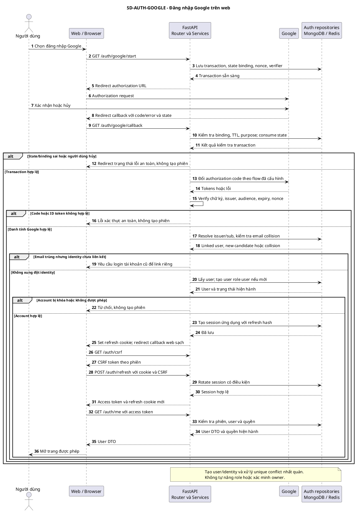
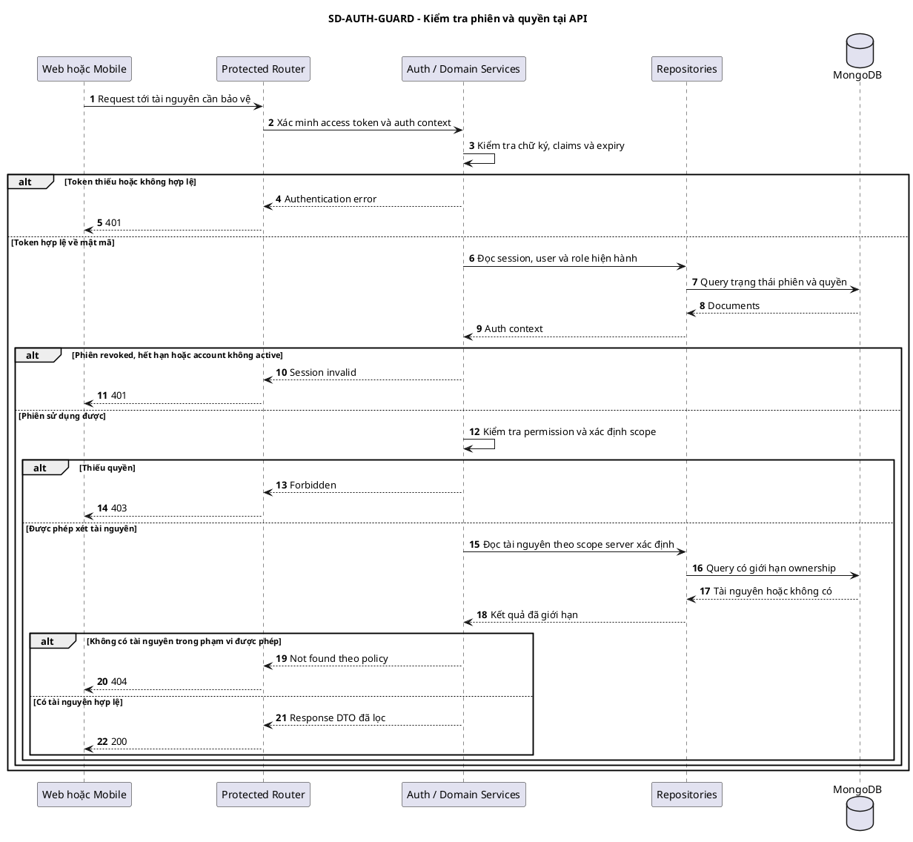
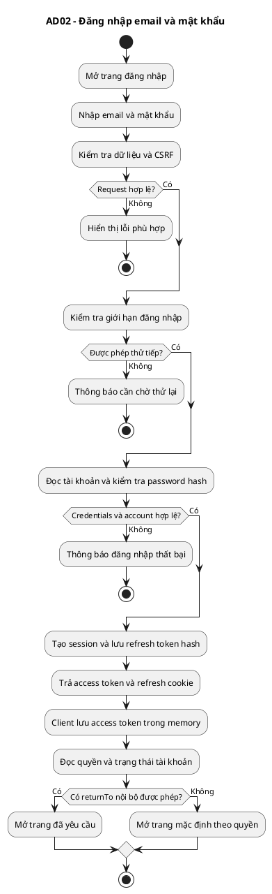
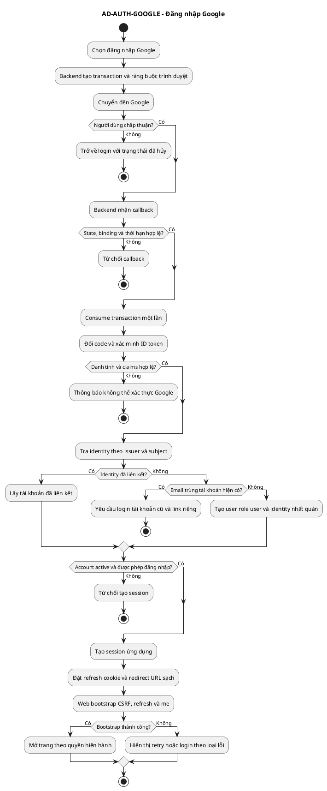

# Prompt bổ sung đăng nhập Google và bảo vệ truy cập

> Áp dụng tiếp trên đồ án hiện tại, cùng MASTER_PROMPT_TOUR_GUIDE.md và UPDATE_PROMPT_FOCUSED_USE_CASES.md. Phụ lục có 6 khối mã PlantUML độc lập: 1 use case, 3 sequence và 2 activity. Đây là source để chỉnh sửa và vẽ, không phải code thực thi ứng dụng.

## 1. Nhiệm vụ và phạm vi

Bạn là AI coding agent. Dự án hiện chưa có trang đăng nhập hoàn chỉnh. Hãy kiểm tra repository rồi trực tiếp triển khai module xác thực, giao diện đăng nhập và kiểm soát truy cập thật trên React + FastAPI + MongoDB. Giữ kiến trúc Router → Service → Repository và các quyết định của master prompt. Không dựng lại dự án từ đầu.

Hoàn thiện:

1. Trang đăng nhập bằng email/mật khẩu.
2. Đăng nhập Google bằng OpenID Connect/OAuth, kiểm tra danh tính tại backend.
3. Khôi phục phiên khi reload, refresh, đăng xuất và thu hồi phiên.
4. Route guard trên web và kiểm tra quyền/ownership tại API.
5. Quên mật khẩu, đặt lại mật khẩu và đổi mật khẩu cho tài khoản có password.
6. Liên kết Google từ một tài khoản đã đăng nhập, xử lý xung đột email an toàn.
7. Trang tài khoản/bảo mật và danh sách phiên của chính người dùng.
8. Schema migration, test, tài liệu cấu hình và mã use case/sequence/activity tương ứng.

Ưu tiên hoàn thiện Web Admin/Owner Portal trước. React Native vẫn được dùng map, POI, nghe, QR, tour và offline không cần đăng nhập. Nếu mobile có khu vực tài khoản thì thêm màn hình đăng nhập và adapter phù hợp; không chặn toàn bộ mobile bằng auth gate.

Không coi đăng nhập thành công là có quyền quản trị. Google không tự xác minh quyền sở hữu quán và không tự cấp role cao hơn.

## 2. Kiểm kê trước khi sửa

Đọc tài liệu và tìm code thực tế: auth routes, user/role repositories, JWT helpers, API client, router, auth store, migration, seed và mã sơ đồ.

Ghi ngắn những gì đã có, còn thiếu hoặc có mâu thuẫn. Tái sử dụng module hiện có; không tạo hai AuthProvider, hai HTTP client hoặc hai bộ token logic.

Giữ các collection nền tảng, đặc biệt:

- `admin_users`: đây là tên collection tài khoản hiện hành dù không phải mọi document đều là admin. Không tự tạo collection `users` song song.
- `roles`: `admin_users.role` tham chiếu `roles.name`.
- ID và reference dùng string; không chuyển sang ObjectId.
- Bốn role theo baseline: `super_admin`, `admin`, `poi_owner`, `user`.
- `is_active`, `is_verified`, `is_poi_owner_verified` có ý nghĩa riêng. Xác minh email Google không đồng nghĩa owner được duyệt.
- `auth_sessions` đã được master prompt đề xuất; kiểm tra implementation trước khi tạo/migrate, không tạo bản trùng tên hoặc khác cấu trúc.

Đối với code hoặc tài liệu sơ đồ chưa có trong workspace, ghi rõ chưa đọc. Không bịa tên file đã sửa hoặc kết quả test.

## 3. Màn hình và trải nghiệm đăng nhập

### Các route web

- `/login`: email, password, hiện/ẩn password, nút đăng nhập, nút Google, quên mật khẩu và liên kết đăng ký chủ quán hiện có.
- `/auth/callback`: hoàn tất khôi phục phiên ứng dụng sau callback backend, không tự xác minh danh tính Google tại frontend.
- `/forgot-password` và `/reset-password`: flow khôi phục tài khoản có password.
- `/account`: thông tin tài khoản thông thường.
- `/account/security`: đổi mật khẩu, liên kết Google, xem/thu hồi phiên của mình.
- `/owner/registration-status`: trạng thái xác minh owner.
- `/403`: đã đăng nhập nhưng không đủ quyền.

Điều chỉnh đường dẫn theo router đang dùng nếu cần; ghi bảng đối chiếu và giữ một nguồn cấu hình chung.

### Yêu cầu giao diện

- Responsive, nhãn rõ, hỗ trợ bàn phím, autofill phù hợp và thông báo lỗi dễ hiểu bằng tiếng Việt.
- Disable submit khi request đang chạy; chặn double-submit, nhưng không coi đó là thay thế kiểm tra backend.
- Hiển thị loading, lỗi mạng, lỗi dữ liệu, đăng nhập thất bại và Google chưa cấu hình đúng trạng thái.
- Không lưu password trong state toàn cục, analytics hoặc localStorage. Dọn form nhạy cảm khi phù hợp.
- Không render nội dung bảo vệ trong lúc còn kiểm tra phiên. Auth state gồm ít nhất `loading`, `authenticated`, `anonymous`, `error`.
- Phân biệt network error lúc bootstrap với 401; không tự đăng xuất người dùng chỉ vì API tạm mất mạng.
- Login thành công trả người dùng về đường dẫn nội bộ được phép. `returnTo` không nhận URL tùy ý; không gây open redirect.
- Nếu user thường đăng nhập, mở `/account`; không tự đưa vào dashboard admin rồi redirect vòng lặp.
- Nếu owner chưa xác minh, chỉ mở các chức năng pending đã cho phép.
- Với Google-only account, không hiển thị form “đổi mật khẩu hiện tại” như thể đã có password. V1 không tự thêm password qua flow reset; muốn hỗ trợ việc đó phải có flow thiết lập riêng được thiết kế rõ.

## 4. Kiểm soát trang và API

Tạo route policy tập trung và mapping tương ứng với permission catalog:

| Phạm vi | Chính sách |
|---|---|
| Nội dung public, map, POI, QR, tour | Không yêu cầu tài khoản; vẫn áp dụng điều kiện công bố và rate limit thích hợp |
| Login, forgot/reset, callback | Có xử lý trạng thái riêng, không nằm trong vòng redirect của protected layout |
| Account/security | Phiên hợp lệ, chỉ dữ liệu tài khoản hiện tại |
| Owner pending/status | Phiên và quyền xem trạng thái của chính tài khoản; không tự cấp quyền quản lý POI |
| Owner POI/menu/submissions | Quyền owner, trạng thái xác minh và ownership đúng tài nguyên |
| Admin content/review | Permission tương ứng; không chỉ kiểm tra role có chuỗi chứa admin |
| Users/roles/audit | Permission riêng và quy tắc chống tự nâng quyền, bảo vệ super_admin cuối cùng |
| Analytics | Quyền view hoặc view_own; server tính phạm vi POI |

Frontend dùng `ProtectedRoute`/layout guard và `PermissionGate` theo cách phù hợp router. Backend dùng dependency xác thực chung, service kiểm tra nghiệp vụ và repository đọc phạm vi được phép.

Không coi ẩn menu là bảo mật. Phải test gọi trực tiếp API khi chưa login, sai quyền hoặc đổi ID sang tài nguyên của owner khác.

Trả 401 cho phiên không hợp lệ; 403 cho thiếu quyền khi phù hợp, hoặc 404 nếu chính sách không tiết lộ tài nguyên. Frontend không refresh token vô hạn khi nhận 403.

## 5. Session và đăng nhập bằng password

Giữ mô hình JWT access token ngắn hạn + refresh session như master prompt. Giá trị khởi đầu đề xuất: access 15 phút, refresh tối đa 7 ngày, có cấu hình và giải thích trong auth policy.

- Access token web nằm trong memory. Refresh token nằm trong cookie HttpOnly, Secure ở HTTPS production; giới hạn path/domain và SameSite theo topology đã chọn.
- Ưu tiên web/API cùng site qua reverse proxy để cấu hình cookie dễ kiểm soát. Môi trường local và production có cấu hình riêng, không mang cờ cookie yếu của dev sang production.
- MongoDB lưu hash refresh token, session ID, expiry và trạng thái thu hồi. Token của Google không phải access token của ứng dụng.
- Token ứng dụng có claims tối thiểu cần thiết; kiểm tra chữ ký, thuật toán được phép, expiry, issuer/audience theo thiết kế. Không chứa PII hoặc password hash.
- Refresh phải có rotation và xử lý replay, với chính sách race/retry được ghi rõ. Client dùng single-flight; tính đến nhiều tab và tình huống response refresh bị mất. Không tự chế cơ chế chấp nhận token cũ vô thời hạn.
- Mỗi protected request xác minh session còn hiệu lực, account active và auth_version đúng trước khi chấp nhận. Nhờ đó logout/khóa tài khoản/thu hồi phiên không chỉ xóa token phía giao diện.
- Permission lấy từ trạng thái server hiện hành hoặc cache có cơ chế invalidation rõ ràng. Không tin permissions đã cũ trong JWT để duy trì quyền bị thu hồi.
- Logout revoke phiên hiện tại và clear cookie đúng thuộc tính đã đặt; logout-all hoặc đổi/reset password tăng auth_version/revoke theo chính sách.
- TTL là cleanup, không thay thế kiểm tra expiry tại service.

Đây là lựa chọn session cho dự án; đối chiếu cấu hình cookie và vòng đời phiên với [OWASP Session Management](https://cheatsheetseries.owasp.org/cheatsheets/Session_Management_Cheat_Sheet.html).

Password dùng thư viện hash duy trì tốt, ưu tiên Argon2id cho hash mới; nếu có hash cũ, hỗ trợ verify/migrate phù hợp. Không lưu plaintext, tự viết crypto hoặc hash password bằng SHA-256 thuần. Không trim/đổi chữ hoa thường của password. Email chuẩn hóa nhất quán theo policy hiện có; không tự bỏ dấu chấm hoặc phần `+tag` của Gmail.

Rate limit login theo các khóa phù hợp, có chống brute-force và thông báo chung cho email/password sai. Không log credentials. Xem [OWASP Authentication](https://cheatsheetseries.owasp.org/cheatsheets/Authentication_Cheat_Sheet.html).

## 6. CSRF, CORS và dữ liệu nhạy cảm

Tạo thiết kế CSRF đầy đủ cho endpoint dùng cookie, gồm refresh/logout và khởi tạo luồng nhạy cảm. Ưu tiên token có ràng buộc với phiên/giao dịch và kiểm tra Origin phù hợp. OAuth `state` phục vụ luồng OAuth, không thay thế CSRF cho toàn bộ API. SameSite là lớp hỗ trợ, không phải lý do bỏ qua thiết kế CSRF. [OWASP CSRF Prevention](https://cheatsheetseries.owasp.org/cheatsheets/Cross-Site_Request_Forgery_Prevention_Cheat_Sheet.html).

Ghi rõ cách frontend lấy CSRF token khi reload, trước khi có access token trong memory. Có thể dùng GET `/auth/csrf` để bootstrap token phù hợp với cookie/phiên; chỉ cho origin hợp lệ đọc, không trả token toàn cục cố định. Kiểm tra cả login CSRF và account-linking CSRF.

CORS dùng allowlist cụ thể; không wildcard cùng credentials. DTO chỉ nhận field được phép, chặn client tự gửi role, verified hoặc user_id để giả danh. Không đưa NoSQL operator từ JSON request thẳng vào query.

Auth response dùng cache policy phù hợp, không cache token qua CDN. Không đưa app access/refresh token vào URL, history hoặc log. Redact cookie, authorization header, OAuth code, reset token và verifier khỏi log/error tracking. Cấu hình header và rendering để giảm XSS; tránh HTML không được xử lý trong profile/provider error.

## 7. Google login cho web

Chọn một flow nhất quán: **backend Authorization Code + OpenID Connect**, sử dụng thư viện hỗ trợ tốt. Google xác thực người dùng, backend kiểm tra kết quả rồi phát session riêng của Tour Guide. Không trộn lẫn popup/GIS credential với redirect code flow mà thiếu một hợp đồng rõ ràng.

Chỉ xin scope `openid email profile`; không xin Drive/Gmail hoặc quyền truy cập offline Google nếu sản phẩm chỉ cần đăng nhập. Client secret nằm backend. Dùng redirect URI cố định đã đăng ký, state ràng buộc trình duyệt/giao dịch, nonce và PKCE S256 khi thư viện/flow hỗ trợ đúng; xác minh tính tương thích trước khi chọn library. Không tự viết xử lý OAuth thủ công để né vấn đề SDK. Tham chiếu [Google Web Server OAuth](https://developers.google.com/identity/protocols/oauth2/web-server).

### Giao dịch OAuth

1. Người dùng chọn Google; backend tạo transaction ngắn hạn, gắn state với browser binding, lưu nonce, verifier và returnTo đã kiểm tra. Dùng Redis hiện có hoặc store tương đương; không giữ trong dictionary RAM đơn lẻ.
2. Redirect sang Google; Google trả code/error và state về callback backend.
3. Backend kiểm tra state, browser binding, expiry và mục đích login/link; consume transaction một lần theo điều kiện. Google hủy hoặc callback lỗi phải được xử lý sạch, không tạo session.
4. Đổi code tại backend; kiểm tra ID token bằng thư viện: chữ ký/key đáng tin cậy, issuer, audience và azp khi cần, expiry, nonce. Không chỉ decode payload.
5. Dùng cặp issuer/subject đã canonicalize theo quy tắc provider làm định danh Google, không lấy email làm định danh ổn định. Trường email phải đáp ứng policy xác minh đã chốt; nếu thiếu hoặc chưa xác minh thì v1 từ chối tạo tài khoản tự động với thông báo phù hợp.
6. Resolve identity tới user theo chính sách bên dưới, kiểm tra trạng thái tài khoản và tạo session ứng dụng.
7. Callback đặt refresh cookie rồi redirect về trang callback sạch của web. Web bootstrap CSRF → refresh để nhận access token trong memory → GET me → điều hướng theo quyền và returnTo hợp lệ. Không truyền app token qua query string.

Kiểm tra claims và nhận diện người dùng theo [Google OpenID Connect](https://developers.google.com/identity/openid-connect/openid-connect). Các bước ghép tài khoản và quyền bên dưới là chính sách cụ thể của dự án, không được suy ra từ việc Google đã xác minh email.

### Chính sách tài khoản

- Identity đã liên kết: đăng nhập đúng user hiện tại, không overwrite role hoặc trạng thái duyệt từ profile Google.
- Chưa có identity, chưa có email trong hệ thống: tạo user tối thiểu với role `user`; user và identity phải được tạo nhất quán, có unique index và xử lý race.
- Chưa có identity nhưng email trùng tài khoản hiện có: **không tự ghép**. Yêu cầu đăng nhập vào tài khoản hiện có rồi liên kết Google qua flow riêng. Không cấp session cho tài khoản cũ chỉ vì email trùng.
- Tài khoản inactive/blocked: không cho vượt qua bằng Google. Không tạo user thứ hai để né trạng thái khóa.
- Không cấp super_admin theo email gửi từ client, avatar, tên miền hoặc profile Google. Không tự đặt `is_poi_owner_verified=true`.
- Profile email Google đổi không tự đổi chủ sở hữu tài khoản hoặc auto-merge với user khác. Giữ liên kết theo issuer/sub và ghi policy cập nhật email rõ ràng.

### Liên kết Google

Người dùng đã login chủ động chọn Link Google tại security settings. Yêu cầu xác thực gần đây phù hợp; transaction mang purpose=link, user_id và session ràng buộc, được kiểm tra lại ở callback. Google identity đã thuộc user khác phải bị từ chối. Không cho callback login bị dùng làm callback link bằng cách sửa query.

V1 không bắt buộc hỗ trợ unlink. Nếu triển khai unlink, phải xác thực lại và bảo đảm người dùng vẫn còn phương thức đăng nhập khả dụng.

### React Native

Không nhúng trang Google login trong WebView hoặc đặt web client secret vào app. Nếu triển khai Google trên mobile trong đợt này, chọn SDK/flow native được hỗ trợ, system browser hoặc SDK phù hợp, cấu hình OAuth client theo platform và development build. Backend kiểm tra audience đúng từng client, nonce/giao dịch và phát session ứng dụng; token native lưu trong SecureStore hoặc cơ chế tương đương.

Không copy cookie bootstrap web sang native rồi nói đã hoạt động. Có contract, sequence/activity và kiểm tra native riêng nếu triển khai. Nếu chưa có màn hình tài khoản mobile, giữ chức năng du lịch public và ghi rõ phạm vi auth đợt này là web/backend.

## 8. Quên mật khẩu và đổi mật khẩu

- Trang forgot password luôn có phản hồi chung, không công khai tài khoản có tồn tại hay không. Rate limit để tránh spam.
- Reset token ngẫu nhiên, một lần, hạn ngắn cấu hình được; lưu hash. Không gửi password cũ hoặc password mới qua email.
- URL reset tạo từ base URL cấu hình/allowlist, không tin Host tùy ý. Trang reset không để token rò qua referrer hoặc analytics.
- Đặt mật khẩu mới chỉ khi token đúng user/purpose, chưa dùng, chưa hết hạn; consume token + đổi hash + vô hiệu hóa phiên nhất quán. Sau reset yêu cầu đăng nhập lại.
- Đổi password khi đang login kiểm tra mật khẩu hiện tại hoặc reauthentication đúng policy.
- Với tài khoản Google-only, flow forgot password không tự biến email thành phương thức khôi phục mạnh hơn policy đã chọn. V1 hướng dẫn dùng Google; không tạo password giả.
- Cấu hình adapter email và môi trường local như mail catcher. Nếu chưa có SMTP production, không giả báo đã kiểm tra gửi email thật hoặc in token nhạy cảm vào log để thay email.

Tham chiếu [OWASP Forgot Password](https://cheatsheetseries.owasp.org/cheatsheets/Forgot_Password_Cheat_Sheet.html). Phần này là bổ sung chức năng xác thực, không tự mở rộng thành hệ thống gửi email marketing.

## 9. MongoDB và thay đổi tương thích

### admin_users

Giữ trường baseline. Bổ sung có migration khi cần:

- `password_hash`: cho phép null/absent với Google-only account; validator và DTO phải theo cùng policy. Login password với tài khoản đó phải thất bại đúng cách.
- `email_verified_at`, `avatar_url`, `last_login_at`, `auth_version` nếu chưa có.
- Không dùng `is_poi_owner_verified` cho email verification; ghi ý nghĩa các trường verified trong data dictionary.

### auth_identities — collection bổ sung

`_id string`, `user_id string`, `provider string`, `issuer string`, `subject string`, `email_at_link string|null`, `created_at date`, `last_login_at date`.

Unique `(provider, issuer, subject)`. V1 có thể unique `(user_id, provider)` nếu chỉ cho một tài khoản Google/user; ghi lựa chọn và test. `user_id` tham chiếu `admin_users._id`. Không lưu Google access/refresh token lâu dài khi chỉ cần đăng nhập.

### auth_sessions — dùng lại phần mở rộng đã chốt

Các trường tối thiểu: `_id`, `user_id`, `refresh_token_hash`, `token_family_id`, `auth_version`, `created_at`, `last_used_at`, `expires_at`, `revoked_at`. Thêm `authenticated_at` và `reauthenticated_at` nếu dùng recent-auth; refresh token không tự làm mới thời điểm xác thực mạnh. Bổ sung metadata thiết bị tối thiểu để người dùng phân biệt phiên, không thu fingerprint quá mức.

TTL expires_at, index theo user/status; server vẫn kiểm tra expiry. Đảm bảo kiểu date và string reference nhất quán với baseline.

### auth_action_tokens — reset password

`_id string`, `user_id string`, `purpose string`, `token_hash string`, `created_at date`, `expires_at date`, `consumed_at date|null`.

Unique token hash, TTL cleanup; consume có điều kiện. Không dùng chung reset token và refresh token.

### OAuth transaction

Dùng Redis TTL cho state/binding/nonce/verifier/purpose. Nếu buộc dùng MongoDB thì khai báo schema/index rõ trong schema-additions; không tự tạo thêm một store khác cùng lúc.

Mọi thay đổi có script migration/index idempotent, default cho dữ liệu cũ, cập nhật ERD và rollback khả thi. Không drop collection, đổi ID, xóa user hoặc tự gán role lại để seed cho nhanh.

## 10. API, lớp code và cấu hình

Chuẩn hóa tiền tố auth hiện có; tránh một bộ `/admin/auth` và một bộ `/auth` cùng làm một việc. Nếu chưa có implementation, dùng `/api/v1/auth` làm chuẩn và ghi thay đổi đường dẫn so với đề xuất cũ.

| Method | Endpoint tương đối | Ý nghĩa |
|---|---|---|
| GET | /csrf | Bootstrap CSRF theo policy |
| POST | /login | Email/password, kiểm tra CSRF/rate limit phù hợp |
| POST | /refresh | Rotate session và trả access token |
| GET | /me | User DTO và quyền hiện hành |
| POST | /logout | Revoke phiên hiện tại |
| POST | /logout-all | Revoke các phiên theo policy đã công bố |
| POST | /forgot-password | Yêu cầu reset, phản hồi chung |
| POST | /reset-password | Consume token và đổi password |
| POST | /change-password | Đổi password với reauthentication |
| POST | /reauthenticate | Xác thực lại bằng phương thức đã có, ghi recent-auth vào phiên |
| GET | /google/start | Bắt đầu login Google; returnTo allowlist và browser binding |
| GET | /google/callback | Callback backend, không phải route React |
| POST | /google/link/start | Bắt đầu link có auth, CSRF và recent-auth; trả authorization URL |
| GET | /sessions | Các phiên của chính user |
| DELETE | /sessions/{id} | Thu hồi phiên thuộc chính user |

Callback Google phân biệt purpose bằng transaction lưu tại server. Không tin mode hoặc user_id tự gửi trên callback. GET start chỉ khởi tạo giao dịch, không tự gán quyền hoặc liên kết tài khoản.

Phân lớp gợi ý, ưu tiên tái sử dụng tên file hiện tại:

- Router: auth routes, Google redirect/callback, request/response DTO.
- Services: AuthService, SessionService, GoogleIdentityService, PasswordRecoveryService hoặc chia nhỏ tương đương.
- Repositories: users, identities, sessions, action tokens; không gọi MongoDB từ React hay trực tiếp trong Router.
- Integrations: Google OIDC client, email adapter; library blocking phải được xử lý ngoài event loop phù hợp.
- Web: auth API client, auth provider/store, bootstrap hook, route guards, pages và form components.

Không dồn toàn bộ auth vào một file hàng nghìn dòng; cũng không tạo generic framework riêng. Dùng một nguồn validation, error code và permission mapping.

`.env.example` cần mô tả Google client ID/secret, callback URL, frontend URL/allowed return paths, JWT/session settings, cookie policy, Mongo/Redis, SMTP và public API base URL. Không commit secret; frontend chỉ nhận cấu hình công khai.

Hướng dẫn cấu hình Google Cloud phải bám tài liệu hiện hành: OAuth consent, client kiểu web, callback URI khớp chính xác và test users khi cần. Nếu thiếu credentials, hoàn thiện code và báo integration chưa kiểm chứng; không dùng Google mock làm kết quả production.

## 11. Use case, sequence và activity phải cập nhật

Đọc source sơ đồ hiện có trước khi sửa. Bảng ID sau là đề xuất cho ID còn trống, không được overwrite một ID đã mang nghĩa khác:

| ID | Use case |
|---|---|
| U01 | Giữ đăng nhập hiện có; làm rõ flow email/password |
| U02 | Giữ đăng xuất; bổ sung revoke thực tế |
| U03 | Giữ đổi mật khẩu |
| U04 | Đăng nhập Google |
| U05 | Yêu cầu khôi phục mật khẩu |
| U06 | Đặt lại mật khẩu qua token |
| U07 | Liên kết tài khoản Google |
| U08 | Xem và thu hồi phiên của mình |

U04–U08 là bổ sung của đợt auth, phải có changelog. Nếu catalog đã có cùng mục tiêu dưới ID khác, tái sử dụng ID đó và remap các diagram mẫu bên dưới. Không tái sử dụng Sxx để tránh trùng Uxx.

Google là supporting actor bên ngoài; MongoDB/Redis là thành phần nội bộ. Không vẽ protected page include Login để yêu cầu người dùng login lại mỗi lần mở trang. Preconditions và API checks mô tả riêng.

Tài liệu Focused UC có actor, trigger, preconditions, bảng bước, alternatives, exceptions, postconditions, BR, schema/API mapping và acceptance tests. Phân biệt login với account linking; không dùng extend chỉ vì hai phương thức đăng nhập cùng tồn tại.

Sửa trực tiếp mã Eraser/PlantUML đang được duy trì và cập nhật SD02/AD02 hiện có. Tạo ID mới như SD-AUTH-GOOGLE, SD-AUTH-GUARD, AD-AUTH-GOOGLE nếu phù hợp, không đánh số lại SD01–SD15 hoặc AD01–AD16. Mã trong phụ lục là thiết kế khởi đầu, phải sửa để khớp implementation cuối.

Ngoài sáu mẫu kèm theo, bổ sung sequence/activity cho reset password, link Google, refresh/logout nếu tài liệu hiện có chưa thể hiện rõ. Mỗi sơ đồ giữ phạm vi nhỏ. Không chỉ trả ảnh rồi bỏ source.

## 12. Test và điều kiện hoàn thành

Tối thiểu kiểm tra:

1. Email/password đúng/sai, account inactive và account không có password.
2. Không có token → protected API bị từ chối; sửa localStorage/role ở client không nâng được quyền.
3. Owner A không truy cập dữ liệu của owner B; user thường không vào admin API.
4. Reload khôi phục phiên đúng, không lóe nội dung protected; network error không tạo redirect loop.
5. Access hết hạn → refresh hợp lệ; refresh sai/hết hạn/revoked bị từ chối; concurrency/mất response theo policy được test.
6. Logout, logout-all, đổi/reset password và khóa account có hiệu lực phía server.
7. Callback thiếu/sai/replayed state hoặc browser binding sai không tạo phiên.
8. ID token sai signature/issuer/audience/expiry/nonce không được chấp nhận; chỉ decode JWT không được xem là test verification.
9. Google user mới chỉ có role user; không trở thành owner verified hoặc admin.
10. Email trùng local account không tự merge; linking cần phiên phù hợp và identity chưa thuộc người khác.
11. Hai callback đồng thời không tạo hai user/identity cho cùng Google subject.
12. Người dùng hủy Google, provider lỗi, code đổi thất bại và thiếu cấu hình đều có UX rõ, không lộ secret.
13. returnTo độc hại không redirect ra ngoài; callback không chứa app token trong URL.
14. Cookie endpoints kiểm tra CSRF; origin ngoài allowlist không đọc/gọi được theo credential policy.
15. Reset token hết hạn/đã dùng không đổi password; hai request consume chỉ một thắng; không lộ tài khoản qua forgot endpoint.
16. Phiên người khác không thể bị xóa qua đổi session ID; danh sách phiên không trả refresh hash.
17. Map, POI, nghe, QR, offline và tour public vẫn dùng được khi chưa login.
18. Test web end-to-end cho login, route guard và logout; Google có mock kiểm soát cho error cases và kiểm tra thật khi có credentials. Báo rõ hai loại bằng chứng.

Bàn giao source code, migration, OpenAPI/types đã cập nhật, env example, hướng dẫn Google/SMTP, test report và source diagram. Cập nhật traceability từ UC → screen → API → service → collection → test.

Không tuyên bố “bảo mật tuyệt đối”. Báo cụ thể đã thực hiện gì, đã kiểm tra gì và phần nào cần credentials/thiết bị/môi trường thật.

## 13. Thứ tự thực hiện

1. Kiểm kê auth hiện có, khóa policy session/route/role và schema additions.
2. Backend password login/session/me/logout; web login và bootstrap/guards; test một full slice.
3. Google web login và linking, migration identity và các error cases.
4. Recovery/change password, session management, security settings và email adapter.
5. Kiểm tra các route/ownership đang có; tích hợp mobile account nếu phạm vi thực sự có.
6. Cập nhật Focused UC và source diagram cùng code, chạy test, bàn giao hướng dẫn cấu hình.

Bắt đầu thực hiện ngay trên code hiện có. Không chỉ tạo màn hình đẹp dùng token giả. Không dừng hỏi có muốn tiếp tục sau mỗi file; xử lý các việc đã được yêu cầu cho tới khi có kết quả chạy được hoặc một điều kiện bên ngoài thực sự chặn.

## 14. Mã PlantUML để vẽ

Mỗi khối dưới đây là một file `.puml` độc lập. Không dán nguyên PlantUML vào editor Eraser DSL. Nếu đang dùng Eraser, AI phải chuyển đúng cú pháp và giữ cùng nội dung; bản PlantUML là source UML để đối chiếu. Đây là sáu sơ đồ thiết kế mẫu, chưa được render kiểm chứng trong lần soạn prompt này.

### 14.1 Use case xác thực

### 14.2 Sequence đăng nhập email/password

### 14.3 Sequence Google login trên web

### 14.4 Sequence bảo vệ API

### 14.5 Activity đăng nhập email/password

### 14.6 Activity Google login

Các bước provider/storage có thể lỗi và phải có xử lý implementation như phần test. Sơ đồ mẫu ưu tiên nhánh xác thực/phân quyền; AI bổ sung nhánh hạ tầng cần thiết khi chốt thiết kế, không xem việc sơ đồ gộp bước là cho phép bỏ error handling.
