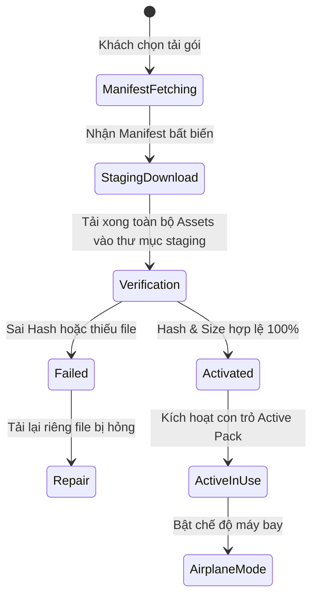

# Offline Architecture & Native Sync Protocol

Tài liệu này đặc tả cơ chế đóng gói (packaging), tải về (download staging), xác thực (verification), kích hoạt (activation), sửa lỗi (repair) và sử dụng dữ liệu ngoại tuyến (offline usage).

---

## 1. Kiến trúc Hai Tầng Lưu trữ Cục bộ trên Mobile

1. **SQLite (`expo-sqlite`)**:
   - Lưu trữ metadata có cấu trúc: thông tin POI, menu, bản dịch, lộ trình tour, ánh xạ QR, nhật ký cooldown, cài đặt và hàng chờ outbox.
   - Cho phép tìm kiếm nhanh POI theo từ khóa, lọc theo category, tính khoảng cách haversine mà không cần mạng.
2. **Native File System (`expo-file-system`)**:
   - Lưu trữ các tệp nhị phân lớn: file âm thanh MP3 (`.mp3`) và hình ảnh địa điểm (`.jpg`, `.png`).
   - Đường dẫn file được lưu trong bảng SQLite `media_assets` để trình phát `NarrationController` nạp trực tiếp qua giao thức `file://`.

---

## 2. Quy trình Vòng đời Gói Dữ liệu Ngoại tuyến (Offline Pack Lifecycle)

### Bước 1: Lấy Manifest Bất biến (Immutable Manifest)
- Endpoint: `GET /api/v1/offline/manifests/{id}`.
- Manifest chứa danh sách các assets cần tải, URL tải, dung lượng byte và mã băm SHA-256 (`manifest_hash`).

### Bước 2: Tải vào Thư mục Tạm (Staging Directory)
- Các file asset được tải vào thư mục tạm `staging_{pack_id}_{version}/`.
- Quá trình tải có concurrency giới hạn (tối đa 3 luồng đồng thời) để tránh quá tải I/O trên thiết bị di động.

### Bước 3: Xác thực Kích thước và Kiểm tra Băm (Verify Checksum)
- Kiểm tra dung lượng byte thực tế của từng file trên đĩa khớp với manifest.
- Nếu phát hiện lỗi hoặc người dùng hủy giữa chừng: Giữ nguyên gói active phiên bản cũ, đánh dấu gói mới là `failed` hoặc `incomplete`.

### Bước 4: Chuyển đổi Con trỏ Kích hoạt Nguyên tử (Atomic Activation)
- Cập nhật bản ghi metadata trong SQLite trong một transaction: chuyển trạng thái gói mới sang `active`, trỏ các bản ghi POI sang phiên bản mới.
- Xóa thư mục staging cũ sau khi kích hoạt thành công.

### Bước 5: Kiểm thử Chế độ Máy bay (Airplane Mode Acceptance Test)
1. Tải thành công gói offline Quận 4.
2. Bật Chế độ Máy bay (ngắt toàn bộ Wi-Fi và 4G/5G) trên thiết bị.
3. Thoát ứng dụng và mở lại (kill app & restart).
4. Xác nhận:
   - Danh sách POI hiển thị đầy đủ, bản đồ offline hiển thị đúng phạm vi đã tải.
   - Bấm nghe audio phát mượt mà từ file cục bộ, không gặp lỗi mạng hoặc crash.
   - Quét mã QR offline tra cứu chính xác địa điểm tương ứng trong bảng `qr_snapshots`.

---

## 3. Quy trình Sửa chữa (Repair) & Xóa Gói (Delete)

- **Repair**: Quét lại toàn bộ các asset trong bảng `media_assets`. File nào bị thiếu trên disk hoặc sai dung lượng sẽ được đưa vào hàng chờ tải lại mà không cần tải lại toàn bộ gói từ đầu.
- **Delete**: Khi xóa gói, hệ thống kiểm tra các asset dùng chung giữa các ngôn ngữ/gói. Chỉ xóa vật lý các file không còn được gói nào khác tham chiếu.
